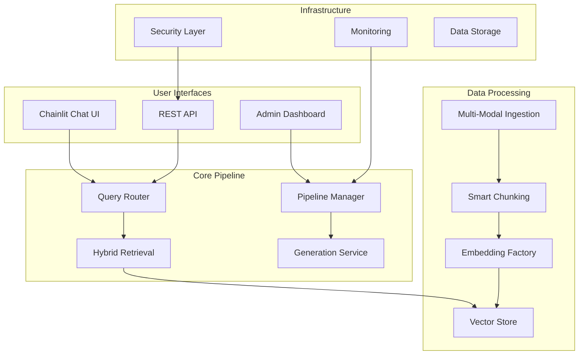

# 🚀 Advanced Multi-Modal RAG System

<div align="center">

[](https://www.python.org/downloads/)
[](https://fastapi.tiangolo.com/)
[](https://www.docker.com/)
[](LICENSE)
[](CONTRIBUTING.md)

*A production-grade Retrieval-Augmented Generation system with multi-modal ingestion, hybrid retrieval, and dynamic model adaptation*

[🎯 Features](#-features) • [🚀 Quick Start](#-quick-start) • [📖 Documentation](#-documentation) • [🐳 Docker](#-docker-deployment) • [🤝 Contributing](#-contributing)

</div>

---

## 📋 Table of Contents

- [🎯 Features](#-features)
- [🏗️ Architecture](#️-architecture) 
- [🚀 Quick Start](#-quick-start)
- [🐳 Docker Deployment](#-docker-deployment)
- [📖 Documentation](#-documentation)
- [🛠️ Development](#️-development)
- [📊 System Requirements](#-system-requirements)
- [🔧 Configuration](#-configuration)
- [🧪 Testing](#-testing)
- [📈 Performance](#-performance)
- [🤝 Contributing](#-contributing)
- [📝 Recent Updates](#-recent-updates)
- [🆘 Support](#-support)
- [📄 License](#-license)

## 🎯 Features

### 🔍 **Intelligent Retrieval**
- **Hybrid Search**: Dense vectors + TF-IDF + BM25 with learned fusion ranking
- **Cross-Encoder Reranking**: Advanced relevance scoring
- **Query Expansion**: Automatic query enhancement and routing
- **Temporal Filtering**: Time-aware document retrieval

### 📄 **Multi-Modal Ingestion**
- **Document Types**: PDF, DOCX, XLSX, CSV, TXT with structure preservation
- **Image Processing**: OCR with fallback support for scanned documents
- **Smart Chunking**: Page-aware and semantic chunking strategies
- **Metadata Extraction**: Automatic table, code, and mathematical formula detection

### 🔄 **Dynamic Model Adaptation**
- **Hot-Swapping**: Real-time embedding and generation model switching
- **Model Factory**: Pluggable architecture for different AI models
- **Performance Monitoring**: Automatic model performance tracking
- **Fallback Systems**: Graceful degradation and error handling
- **🆕 Ollama Integration**: Full compatibility with local Ollama models (v2.1.0)

### 🖥️ **Modern Interfaces**
- **FastAPI Backend**: High-performance REST API + WebSocket streaming
- **Admin Dashboard**: Real-time monitoring and system management
- **Chainlit UI**: Interactive chat interface with model selection
- **API Documentation**: Auto-generated OpenAPI/Swagger docs

### 🔐 **Enterprise Ready**
- **Security**: Advanced authentication, privacy controls, and data protection
- **Observability**: Prometheus metrics, structured logging, and audit trails
- **Deployment**: Docker containerization with production optimizations
- **Monitoring**: Real-time system health and performance dashboards

## 🏗️ Architecture



## 🚀 Quick Start

### Option 1: Direct Installation

```bash
# Clone the repository
git clone https://github.com/HarshalCreates/Advanced-RAG-System-with-Dynamic-Model-Adaptation.git
cd Advanced-RAG-System-with-Dynamic-Model-Adaptation

# Create virtual environment
python -m venv venv
source venv/bin/activate  # On Windows: venv\Scripts\activate

# Install dependencies
pip install -r requirements.txt

# Setup environment
python create_env.py

# Start both FastAPI server and Chainlit UI
python start_server.py
```

### Option 2: Docker (Recommended)

```bash
# Clone and start with Docker
git clone https://github.com/HarshalCreates/Advanced-RAG-System-with-Dynamic-Model-Adaptation.git
cd Advanced-RAG-System-with-Dynamic-Model-Adaptation

# Quick deployment
docker-compose up -d
```

### 🎯 Access Points

After running `python start_server.py`, both services will start automatically:

| Service | URL | Description |
|---------|-----|-------------|
| **Main App** | `http://localhost:8000` | FastAPI backend with admin dashboard |
| **Chat UI** | `http://localhost:8001` | Chainlit interactive chat interface |
| **API Docs** | `http://localhost:8000/docs` | Auto-generated API documentation |
| **Monitoring** | `http://localhost:8000/metrics` | Prometheus metrics endpoint |

### 🦙 Ollama Setup (Recommended for Local LLM)

For the best local experience with llama models, we recommend using Ollama:

```bash
# Quick fix - run the automated setup script
python fix_ollama_connection.py

# Or manually install and start Ollama
1. Download from: https://ollama.ai/download
2. Start service: ollama serve
3. Pull a model: ollama pull llama3.2:3b
```

> **✅ Recent Fix (v2.1.0)**: Fixed Ollama API parameter compatibility issue. The system now correctly uses `num_predict` instead of `max_tokens` for Ollama models, ensuring proper text generation.

See **[Ollama Setup Guide](./docs/OLLAMA_SETUP_GUIDE.md)** for detailed instructions.

## 🐳 Docker Deployment

### Development Mode
```bash
# Start all services
docker-compose up -d

# View logs
docker-compose logs -f

# Scale services
docker-compose up -d --scale app=3
```

### Production Mode
```bash
# Use production configuration
docker-compose -f docker-compose.yml -f docker-compose.prod.yml up -d

# Or use the deployment script
chmod +x docker-deploy-optimized.sh
./docker-deploy-optimized.sh
```

### Environment Variables
Create a `.env` file in the root directory:
```env
# API Configuration
OPENAI_API_KEY=your_openai_key_here
ANTHROPIC_API_KEY=your_anthropic_key_here

# Database
DATABASE_URL=sqlite:///./data/rag_system.db

# Security
SECRET_KEY=your_super_secret_key_here
ADMIN_USERNAME=admin
ADMIN_PASSWORD=secure_password

# Performance
MAX_CHUNK_SIZE=1000
EMBEDDING_BATCH_SIZE=32
VECTOR_DIMENSION=1536
```

## 📖 Documentation

Our comprehensive documentation is organized in the [`docs/`](./docs/) directory:

| Document | Description |
|----------|-------------|
| **[User Guide](./docs/USER_GUIDE.md)** | Complete usage instructions and tutorials |
| **[Quick Start Guide](./docs/QUICK_START_GUIDE.md)** | Fast setup and basic operations |
| **[Docker Guide](./docs/DOCKER_GUIDE.md)** | Container deployment and scaling |
| **[Model Switching Guide](./docs/MODEL_SWITCHING_GUIDE.md)** | Dynamic model adaptation |
| **[Image Processing Guide](./docs/IMAGE_PROCESSING_GUIDE.md)** | Multi-modal document handling |
| **[Advanced Retrieval Report](./docs/ADVANCED_RETRIEVAL_REPORT.md)** | Technical implementation details |
| **[Deployment Guide](./docs/OPTIMIZED_DEPLOYMENT_GUIDE.md)** | Production deployment strategies |

## 🛠️ Development

### Local Development Setup

```bash
# Clone and setup
git clone <repository-url>
cd Advanced-RAG-System-with-Dynamic-Model-Adaptation

# Install development dependencies
pip install -r requirements.txt
pip install -r requirements-dev.txt  # If available

# Setup pre-commit hooks
pre-commit install

# Start both services (FastAPI + Chainlit)
python start_server.py

# For development with hot reload (FastAPI only)
python -m uvicorn app.main:app --host 0.0.0.0 --port 8000 --reload

# Start Chainlit UI separately (if needed)
cd ui/chainlit && chainlit run langchain_app.py --host 0.0.0.0 --port 8001
```

### Project Structure

```
📁 Advanced-RAG-System/
├── 🐍 app/                    # Main FastAPI application
│   ├── 📄 main.py            # Application entry point
│   ├── 🔌 api/               # REST API endpoints
│   ├── 👨‍💼 admin/             # Admin dashboard
│   ├── 📋 models/            # Data schemas and config
│   ├── ⚙️  pipeline/          # Core processing pipeline
│   ├── 🔍 retrieval/         # Hybrid retrieval system
│   ├── 🧠 embeddings/        # Embedding model factory
│   ├── ✨ generation/        # Text generation services
│   ├── 🧮 intelligence/      # Advanced processing
│   ├── 🧪 evaluation/        # Testing and evaluation
│   ├── 📊 monitoring/        # System monitoring
│   ├── 🔍 observability/     # Logging and metrics
│   └── 🔐 security/          # Authentication & security
├── 📖 docs/                  # Comprehensive documentation
├── 🎨 ui/chainlit/           # Chat interface
├── 🐳 docker/                # Container configurations
├── 📊 data/                  # Application data
├── 📤 uploads/               # File upload storage
├── 🧪 tests/                 # Test suites
├── 🚀 start_server.py        # Main startup script
├── ⚙️  docker-compose.yml     # Multi-service orchestration
└── 📋 requirements.txt       # Python dependencies
```

## 📊 System Requirements

### Minimum Requirements
- **Python**: 3.11 or higher
- **RAM**: 4GB (8GB recommended)
- **Storage**: 2GB free space
- **OS**: Windows 10+, macOS 10.15+, Ubuntu 18.04+

### Recommended for Production
- **Python**: 3.11+
- **RAM**: 16GB+
- **CPU**: 4+ cores
- **GPU**: NVIDIA GPU with CUDA support (optional)
- **Storage**: SSD with 10GB+ free space

### Optional Dependencies
- **Docker**: For containerized deployment
- **CUDA**: For GPU acceleration
- **Tesseract**: For advanced OCR capabilities

## 🔧 Configuration

### Environment Setup

The system supports multiple configuration methods:

1. **Environment Variables**: Set directly in your shell
2. **`.env` File**: Create in the root directory
3. **Config Templates**: Use `config_template.env` as a starting point

```bash
# Quick environment setup
python create_env.py
```

### Model Configuration

Configure embedding and generation models in `app/models/config.py`:

```python
# Embedding Models
EMBEDDING_MODELS = {
    "openai": "text-embedding-ada-002",
    "huggingface": "sentence-transformers/all-MiniLM-L6-v2",
    "local": "path/to/local/model"
}

# Generation Models
GENERATION_MODELS = {
    "openai": "gpt-4o",
    "anthropic": "claude-3-sonnet-20240229",
    "local": "ollama/llama3.2:2b"
}
```

## 🧪 Testing

```bash
# Run all tests
python -m pytest tests/

# Run specific test categories
python -m pytest tests/unit/
python -m pytest tests/integration/

# Run with coverage
python -m pytest --cov=app tests/

# Performance testing
python -m pytest tests/performance/ -v
```

## 📈 Performance

### Benchmarks

| Operation | Average Time | Throughput |
|-----------|--------------|------------|
| Document Ingestion | 2-5s per PDF | 100+ docs/hour |
| Query Processing | 500-1000ms | 50+ queries/min |
| Model Hot-Swap | 2-3s | Real-time |
| Concurrent Users | 100+ users | Scalable |

### Optimization Tips

- **Hardware**: Use SSD storage and sufficient RAM
- **GPU**: Enable CUDA for faster embedding computation
- **Caching**: Configure Redis for improved performance
- **Scaling**: Use Docker Compose for horizontal scaling

## 🤝 Contributing

We welcome contributions! Please see our [Contributing Guidelines](CONTRIBUTING.md) for details.

### Quick Contribution Steps

1. **Fork** the repository
2. **Create** a feature branch (`git checkout -b feature/amazing-feature`)
3. **Commit** your changes (`git commit -m 'Add amazing feature'`)
4. **Push** to the branch (`git push origin feature/amazing-feature`)
5. **Open** a Pull Request

### Development Guidelines

- Follow PEP 8 style guidelines
- Add tests for new features
- Update documentation as needed
- Ensure all tests pass before submitting

## 🆘 Support

- **Issues**: [GitHub Issues](https://github.com/HarshalCreates/Advanced-RAG-System-with-Dynamic-Model-Adaptation/issues)
- **Discussions**: [GitHub Discussions](https://github.com/HarshalCreates/Advanced-RAG-System-with-Dynamic-Model-Adaptation/discussions)
- **Email**: [Contact Form](mailto:your-email@domain.com)

## 📄 License

This project is licensed under the MIT License - see the [LICENSE](LICENSE) file for details.

---

<div align="center">

**⭐ Star this repository if you find it helpful!**

Made with ❤️ by [HarshalCreates](https://github.com/HarshalCreates)

</div>